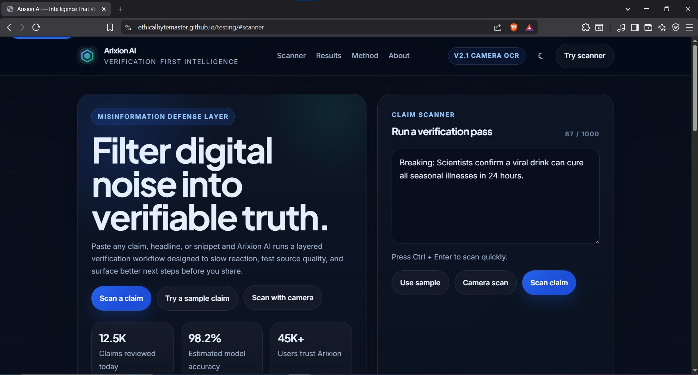
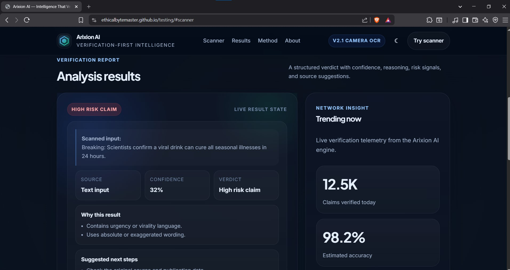
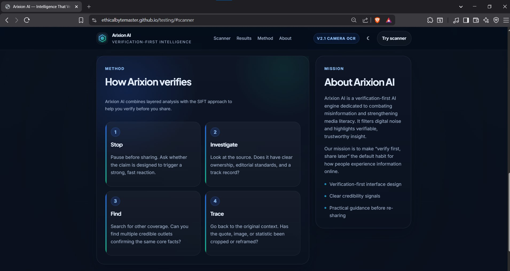
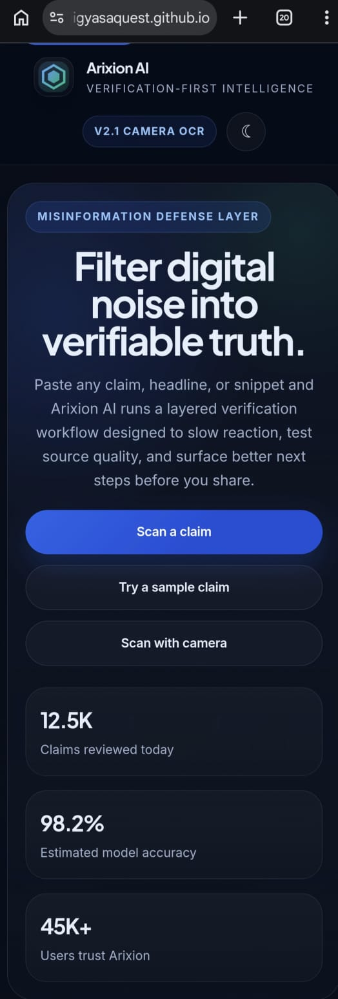
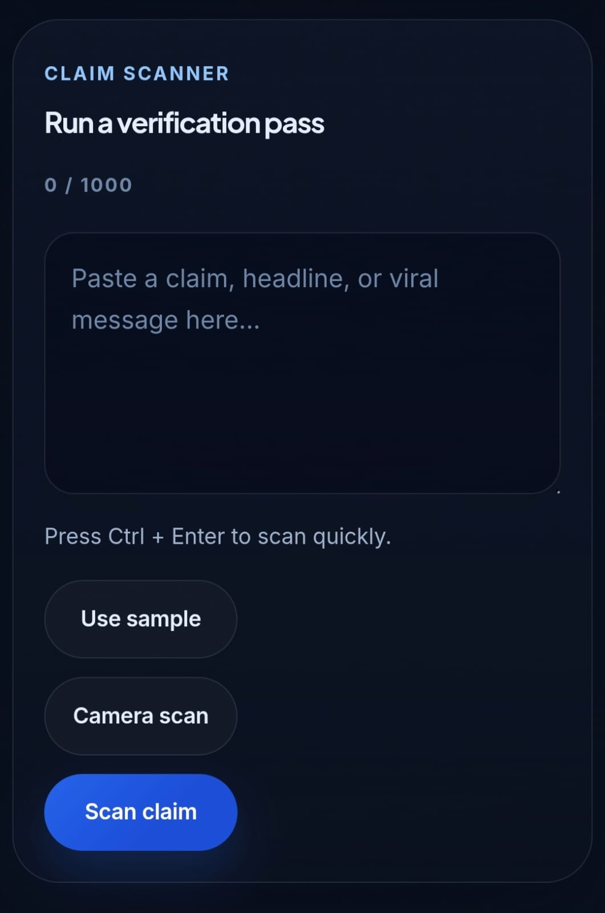
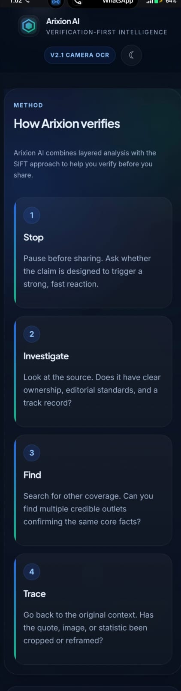
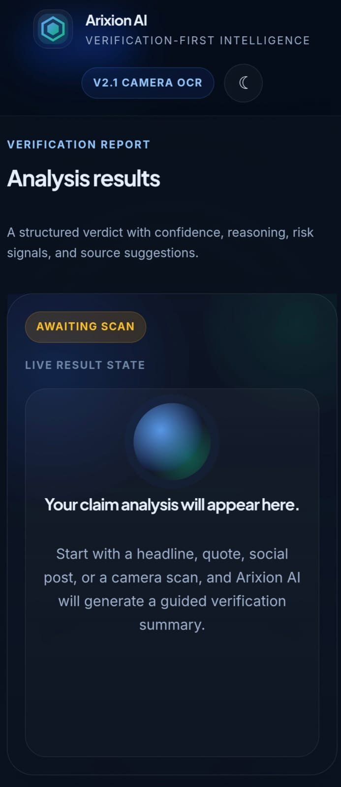

<p align="center">
  
  
  
</p>

<h1 align="center">Arixion AI</h1>

<p align="center">
  <strong>Intelligence That Verifies.</strong>
</p>

<p align="center">
  A verification-first AI experience designed to filter digital noise, analyze claims, and surface more trustworthy, verifiable insight.
</p>

<p align="center">
  <a href="https://jigyasaquest.github.io/arixion-ai/">Live Demo</a>
  ·
  <a href="https://github.com/JigyasaQuest/arixion-ai">Repository</a>
  ·
  <a href="#overview">Overview</a>
  ·
  <a href="#features">Features</a>
  ·
  <a href="#desktop-preview">Desktop Preview</a>
  ·
  <a href="#mobile-view">Mobile View</a>
  ·
  <a href="#getting-started">Getting Started</a>
  ·
  <a href="#roadmap">Roadmap</a>
</p>

---

## Overview

Arixion AI is built for a digital world flooded with fast, noisy, and often misleading information.

Instead of focusing only on answer generation, Arixion AI starts with **verification first**. It is designed to inspect claims, filter weak signals, and guide users toward information they can trust more confidently.

> **Noise in → analysis and filtering → verifiable insight out**

---

## Why Arixion AI

Modern information systems are optimized for speed, virality, and engagement. In that environment, truth is often buried under repetition, bias, and low-quality sources.

Arixion AI aims to reverse that flow by making verification the starting point rather than an afterthought.

It is designed for people who want:
- More signal, less noise
- Clearer reasoning behind outputs
- Trust-oriented AI workflows
- A product philosophy built around verification, not hype

---

## Features

- Verification-first AI workflow
- Layered filtering and analysis pipeline
- Claim-focused reasoning
- Trust-oriented output design
- SIFT-style verification guidance
- Clean interface for scanning and research workflows
- Foundation for future source-checking and credibility systems

---

## Demo

**Live Demo:** [https://jigyasaquest.github.io/arixion-ai/](https://jigyasaquest.github.io/arixion-ai/)

---

## Desktop Preview

<p align="center">
  
</p>

<p align="center">
  
</p>

<p align="center">
  
</p>

---

## Mobile View

<p align="center">
  
  
</p>

<p align="center">
  
  
</p>

---

## Product Direction

Arixion AI is positioned as a verification-first product with a structured interface for scanning claims, guiding verification behavior, and building a more trustworthy AI experience.

This makes Arixion AI closer to a trust-and-credibility layer for information than a generic chatbot product.

---

## Product Philosophy

Arixion AI is not just another AI assistant.

It is built on the belief that the future of intelligence depends on **credibility, transparency, and verification**.

> **Intelligence That Verifies.**

---

## Brand System

| Element | Value |
|---|---|
| Brand name | **Arixion AI** |
| Former name | **JigyasaNews.AI** |
| Tagline | **Intelligence That Verifies.** |
| One-line description | A verification-first AI engine that filters digital noise through layered analysis to surface trustworthy, verifiable insights. |

---

## Visual Identity

### Logo Direction

The visual direction is based on:
- A **magnifying glass** for investigation and scrutiny
- A **layered funnel structure** for analysis, filtering, and refinement
- A minimal geometric form suited to startup, SaaS, and AI product branding

### Color Palette

| Token | Value | Meaning |
|---|---|---|
| Primary | `#2563EB` | Trust, intelligence, signal |
| Accent | `#10B981` | Verified, truth, confidence |
| Background | `#0F172A` | Deep slate for product UI and landing pages |
| Text Primary | `#E5E7EB` | Main readable content |
| Muted Text | `#9CA3AF` | Secondary text |
| Borders / Lines | `#1F2937` | UI structure and separation |

### Typography

- **Headings / Logo:** Inter or Poppins, semibold to bold
- **Body:** Inter regular

---

## Tech Stack

- HTML5
- CSS3
- JavaScript
- Static front-end architecture
- Camera-based browser workflow
- OCR-enabled scanning interface

---

## Getting Started

### Clone the repository

```bash
git clone https://github.com/JigyasaQuest/arixion-ai.git
cd arixion-ai
```

### Run locally

```bash
python -m http.server 8000
```

Then open:

```bash
http://localhost:8000
```

---

## Project Structure

```bash
arixion-ai/
├── index.html
├── style.css
├── script.js
├── README.md
└── assets/
    ├── desktop-home.jpg
    ├── desktop-scanner.jpg
    ├── desktop-method.jpg
    ├── mobile-home.jpeg
    ├── mobile-scanner.jpeg
    ├── mobile-method.jpeg
    └── mobile-results.jpeg
```

---

## Roadmap

Planned direction for Arixion AI includes:
- Source-backed verification workflows
- Stronger claim credibility scoring
- Better reasoning visibility for outputs
- Expanded scanning and extraction flows
- Verification dashboards and research interfaces
- Trust layers for fast-moving digital information

---

## Contributing

Contributions are welcome if they align with the project’s verification-first vision.

You can contribute by:
- Improving UI and UX
- Refining verification workflows
- Strengthening front-end architecture
- Improving performance and accessibility
- Proposing features that increase trust, clarity, and usefulness

### Contribution flow

1. Fork the repository
2. Create a feature branch
3. Make your changes
4. Open a pull request with a clear explanation

---

## License

This project is licensed under the **MIT License**.

---

## Short Description

**Arixion AI — Intelligence That Verifies. A verification-first AI engine that filters digital noise into trustworthy, verifiable insights.**
